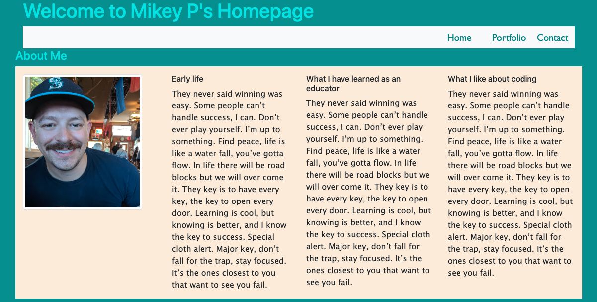
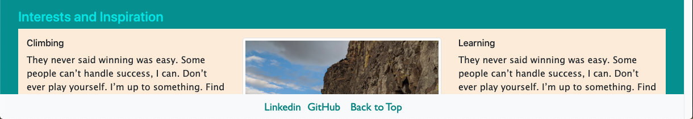
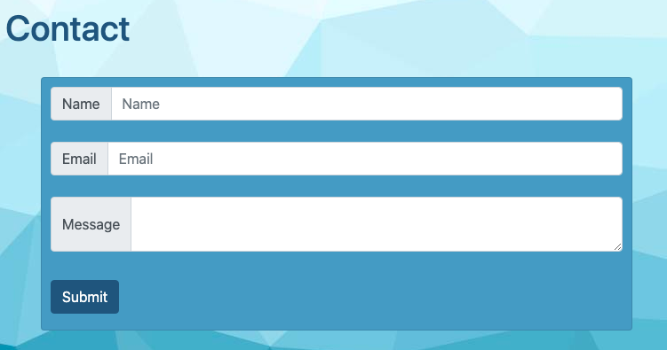

# MikeyP957.github.io

## Introduction
The aim of this project is to provide evidence of my proficiency and growth as a coder. Proficiency of my code will be found on the "portfolio" page and growth will be shown through my GitHub repository through commits and refractors. How I see myself as a coder and a professional can be seen on my personal about me page. 

## Languages and technologies
This project shows my ability to utilize Bootstrap in HTML to build a structure for the content of my pages. The content is aligned using various Bootstrap classes to make the content organized and create a flow for the reader to follow. Images and text containers are responsive to different sized screens. Semantic HTML is used so that the code can be more accessable to users. Links on the home page direct users to my portfolio and a contact page that has been styled similarly.  

The footer is sticky and so it is always readily available at the bottom of the page. The footer also provides links to my linkedin profile and GitHub profile. 

The contact page has text boxes where users can input thier information and submit a message.

## URL:

## Launch
As of 01/06/2021 this project is currently a work in process. As I continue to learn, practice and work on different languages and technologies my portfolio will change accordingly.